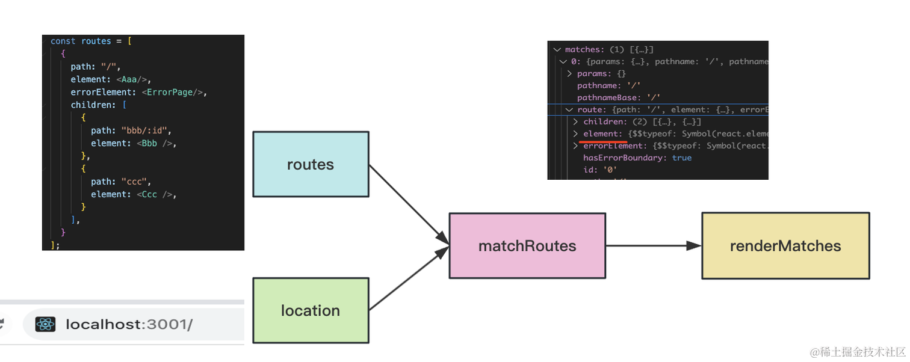
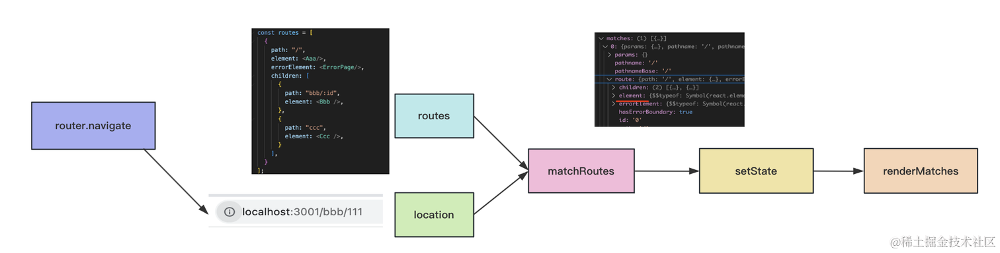
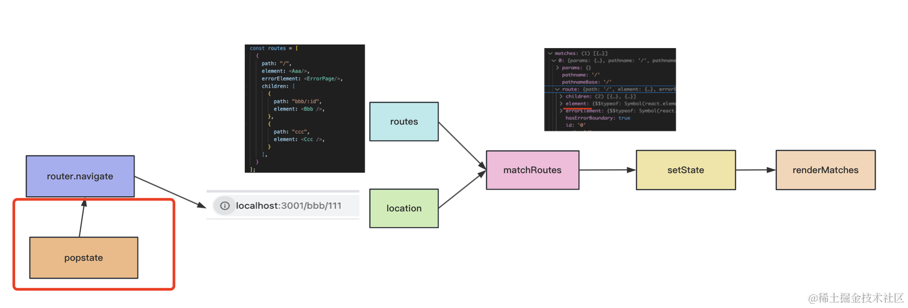

# react-router

## history api
- length：history 的条数
- forward：前进一个
- back：后退一个
- go：前进或者后退 n 个
- pushState：添加一个 history
- replaceState：替换当前 history
- scrollRestoration：保存 scroll 位置，取值为 auto 或者 manual，manual 的话就要自己设置 scroll 位置了

而且还有 popstate 事件可以监听到 history.go、history.back、history.forward 的导航，拿到最新的 location。

这里要注意 pushState、replaceState 并不能触发 popstate 事件。也就是 history 之间导航（go、back、forward）可以触发 popstate，而修改 history （push、replace）不能触发。

## router 源码渲染流程
React Router 就是基于这些 history api 实现的。

### 实现原理
- `首次渲染的时候`，会根据 location 和配置的 routes 做匹配，渲染匹配的组件。
- `之后点击 link 链接` 也会进行 location 和 routes 的匹配，然后 history.pushState 修改 history，之后通过 react 的 setState 触发重新渲染。
- `前进后退的时候`，也就是执行 history.go、history.back、history.forward 的时候，会触发 popstate，这时候也是同样的处理，location 和 routes 的匹配，之后通过 react 的 setState 触发重新渲染。

渲染时会用到 Outlet组件 渲染子路由，用到 useXxx 来取一些匹配信息，这些都是通过 context 来传递的。

### 首次渲染的时候

### 点击link标签

### 那点击前进后退按钮的时候呢？
这个就是监听 popstate，然后也做一次 navigate 就好了：

